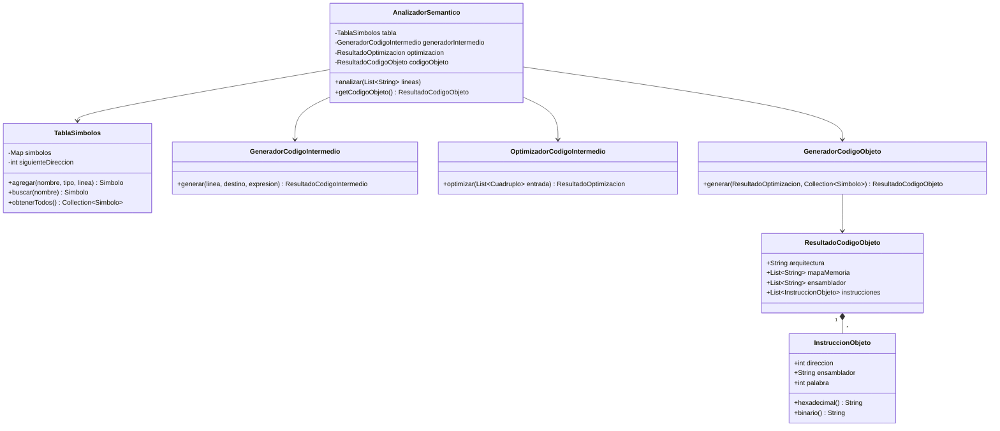

# Diagrama de clases · Proyecto final Unidad 4

El proyecto mantiene las clases de las Unidades 1, 2 y 3 y agrega la etapa de generación de código objeto.

## Flujo que documenta el diagrama

1. `AnalizadorSemantico` valida tipos, declaraciones y expresiones.
2. `GeneradorCodigoIntermedio` produce cuádruplos y código de tres direcciones.
3. `OptimizadorCodigoIntermedio` aplica las reglas de la Unidad 3.
4. `GeneradorCodigoObjeto` recibe **los cuádruplos optimizados** y las direcciones de la tabla de símbolos.
5. `ResultadoCodigoObjeto` conserva el mapa de memoria, el ensamblador y las palabras máquina.
6. `InstruccionObjeto` representa cada instrucción final en ensamblador, hexadecimal y binario.
